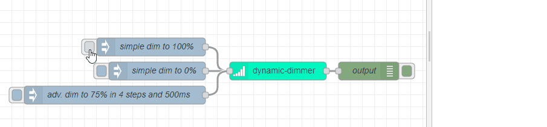

# node-red-contrib-dynamic-dimmer


[](https://www.nodered.org)

The Dynamic Dimmer node for Node-RED was build to mimic the behavior of a physical dimmer switch. A typical use case for this node is the dimming of light bulbs (e.g. Ikea Trådfri bulbs) to a given brightness. In general, it allows a linear animation/easing of a value over a certain time frame. 

<p align="center"> 
    
</p>

## Credits

* [woozar](https://github.com/woozar) - **his node [node-red-contrib-time-based-dimmer](https://github.com/woozar/node-red-contrib-time-based-dimmer) was the basis and a huge inspiration for this project!**

## How to use this node
Similar to a physical dimmer switch, you can specify the desired brightness, or any other parameter, with a **input** (`msg.payload`) between **[0,1]**. The node will then start to emit a series of values in a certain interval until the expected value is reached.

### Node configuration

* **Minimum / Maximum value**: the range of the the output values  
* **Steps**: the number of steps between the min and max
* **Event interval**: the interval between the steps in ms

### Example
Lets assume the following node configuration:
* **Minimum / Maximum value**: 0 / 100
* **Steps**: 10
* **Event interval**: 200ms

When the node receives in the initial state on the input a message with e.g. `msg.payload = 0.5` the node will emit 10, 20, 30, 40 and 50 on the output (to `msg.payload`) in a 200ms interval.

### Advanced usage
Lets imagine that we want to make the dim speed of a light bulb depending on the time of the day. This use case would require to modify the node configuration (e.g. the event interval) at runtime. The dynamic dimmer node supports another input format to enable runtime modifications of the node config: 

```json
{
    "msg": {
        "payload":{
            "target": 0.5,
            "command": "DIM",
            "config": {
                "eventInterval": 600,
                "steps": 10,
                "minValue": 0,
                "maxValue": 100
            }
        }
    }
}
```
Please note that **partial** configuration updates are supported. Hence, you only need to provide the parameters which should be modified.

#### The `command` property
In general, the process of dimming has a very async behavior because one input event triggers a series of output events. For more control of ongoing operations the following commands were introduced:
* `DIM` - this is the default operation and instructs the node to reach the `target` value. If there is already a dimming operation in progress, the node will switch to the new dim target value.
* `PAUSE` - pause an ongoing dim operation (`target` should not be set)
* `RESET` - resets the node to it's initial configuration and sets the output to the `minValue`. If additional config properties are sent, it will merge them with the initial configuration.

## Contribute
In case you want to improve this project please create a PR with your changes. Please make sure to add unit tests to verify your changes.

### Local development and testing setup

Development scripts:
* `npm run build` - obviously builds/transpiles the project
* `npm run test` - runs the jest tests
* `npm run dev` - at the time of writing a hot reloading of code changes is not supported by Node-RED. Hence, to test the node in a Node-RED instance `npm run dev` can be used to build the project and restart the docker container.

The node can be installed in the local Node-RED instance as follows:
```bash
# spin up node red
docker-compose up
mkdir data
# get the container id 
docker ps
# install the node in the container
docker exec -it <CONTAINER_ID> /bin/bash -c "cd /data && npm install ./node-red-contrib-dynamic-dimmer"
```
